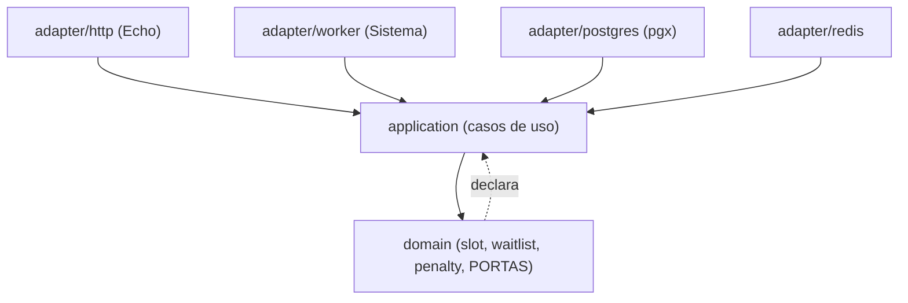
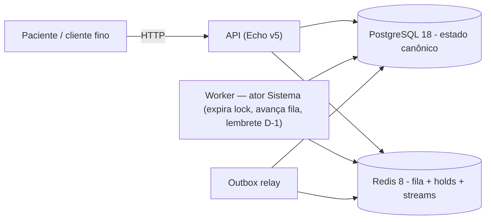
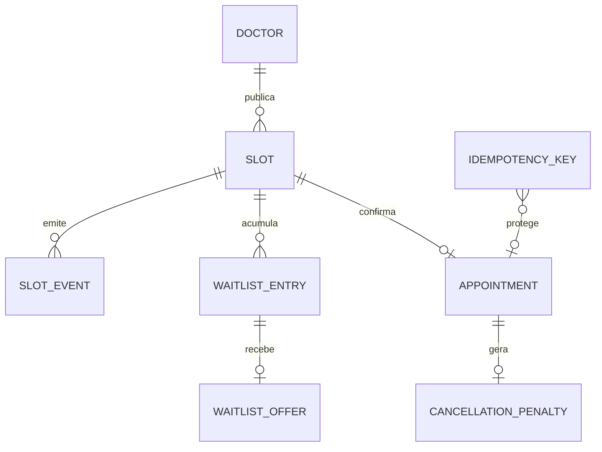
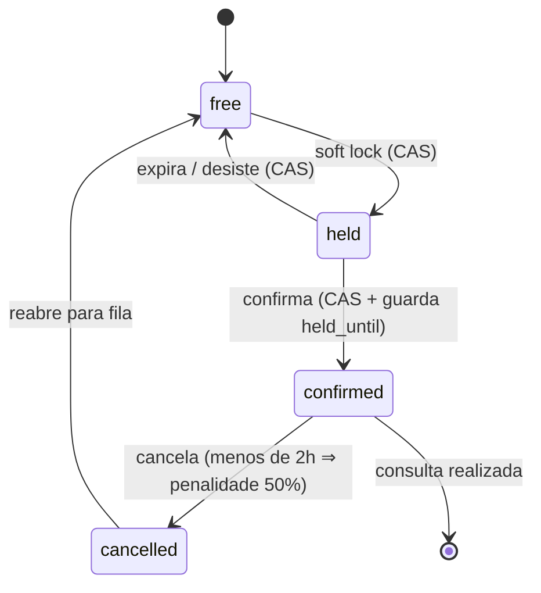

# Architecture Spine — AgendaFácil

> Fast path: itens `[ASSUMPTION]` foram inferidos do brief/addendum e devem ser
> confirmados na revisão. Não há PRD — NFRs (carga, latência, RTO/RPO) não estão
> formalizados; o spine assume "clínica ou rede pequena".
>
> **Blocker para `bmad-spec`:** definir o escopo da fila — `waitlist:<scope>` é
> por `slot_id` ou por `doctor_id + data`? AD-3, AD-4 e AD-9 dependem dessa
> escolha. Os demais `[ASSUMPTION]` são deferíveis.

## Design Paradigm

**Hexagonal (ports & adapters).** O núcleo de domínio decide; a infraestrutura
serve. Concorrência é resolvida por regra de domínio, não por artefato de banco.

| Camada | Namespace | Papel |
| --- | --- | --- |
| Domain | `internal/domain` | Entidades (`slot`, `waitlist`, `penalty`), máquina de estados, portas. Não importa infra. |
| Application | `internal/app` | Casos de uso (confirmar, cancelar, entrar na fila, avançar fila, expirar lock). Orquestra transação + portas. |
| Adapters | `internal/adapter/{http,postgres,redis,worker}` | Echo, pgx, cliente Redis, worker do ator Sistema. Implementam as portas. |
| Platform | `internal/platform` | Config, logging, relógio, migrações. |

O **worker do ator Sistema** é um adapter que invoca os mesmos casos de uso da
API — nenhuma automação tem caminho de escrita próprio.

## Invariants & Rules



Regra: dependências apontam só para dentro. As portas são declaradas no domain e
implementadas nos adapters. `domain` não importa nada de `adapter`/`platform`.

### AD-1 — PostgreSQL é o store transacional canônico (não MongoDB)

- **Binds:** toda persistência de estado — `slot`, `appointment`, `waitlist_entry`, `waitlist_offer`, `idempotency_key`, `slot_event`, `cancellation_penalty`.
- **Prevents:** adotar um document store sem transação multi-linha ACID de primeira classe e sem índice único parcial — a garantia "um slot = no máximo uma consulta confirmada" viraria lógica de aplicação frágil e o double-booking voltaria pela camada de dados.
- **Rule:** o estado canônico vive em Postgres. "No máximo uma confirmada por slot" é uma **constraint de banco** — índice único parcial em `slot_id WHERE status = 'confirmed'` — não uma checagem de aplicação. MongoDB não entra no núcleo. Postgres é escolhido por três propriedades que o núcleo usa diretamente: (a) índice único parcial como rede de segurança independente da corretude do código; (b) transação ACID multi-tabela para "confirmar + sair da fila + gravar evento" atômica; (c) `UPDATE ... WHERE status = 'free'` com contagem de linhas afetadas como CAS otimista nativo, sem lock pessimista.

### AD-2 — Soft lock sem lock pessimista: CAS otimista em Postgres + marca com TTL em Redis

- **Binds:** fluxo `descoberta → held → confirmed`; todos os cenários de concorrência do addendum.
- **Prevents:** `SELECT ... FOR UPDATE` (ou advisory lock bloqueante) segurando a linha do slot durante os 15 min de decisão do paciente — serializa o atendimento, prende conexões, não escala; e dois pacientes confirmando o mesmo slot.
- **Rule:**
  - Toda transição de slot é `UPDATE slots SET status = ?, ... WHERE slot_id = ? AND status = <esperado>`, verificando `rows_affected = 1`. Zero linhas = perdeu a corrida → erro de domínio `SlotUnavailable`. Nunca `FOR UPDATE`, nunca lock bloqueante.
  - O soft lock materializa em duas partes: (a) a linha do slot vai a `status = 'held'` com `held_by` e `held_until = now() + 15min` (UTC) via o CAS acima; (b) a chave Redis `slot:<id>:hold = <patient_id>` com `EX 900`, como índice rápido e fonte de expiração proativa.
  - **Postgres é a verdade; Redis é acelerador.** Em divergência, `held_until` no Postgres decide.
  - Expiração preguiçosa: qualquer leitura ou transição que encontre `status = 'held' AND held_until < now()` trata o slot como `free` e executa o CAS `held → free` antes de prosseguir. O TTL do Redis e o job do ator Sistema são apenas o caminho proativo.
  - Confirmação = CAS `held → confirmed WHERE held_by = ? AND held_until > now()`. Falha por expiração no instante do submit cai no mesmo `SlotUnavailable` (com oferta de entrada na fila).
  - A transição preguiçosa `held → free` também passa pelo método de domínio `Slot.transition` e grava o evento no outbox **na mesma transação** (AD-7, AD-8). Um caminho de leitura que não pode abrir transação de escrita **não executa o CAS** — trata o slot como livre apenas para exibição e deixa a materialização para o worker ou para o próximo caso de uso de escrita que tocar o slot.
  - `[ASSUMPTION]` o lock não é renovável na v1.
  - `[ASSUMPTION]` o discriminador de concorrência é a coluna `status` + timestamps, não uma coluna `version` numérica genérica.

### AD-3 — Redis para a fila de espera e a coordenação efêmera (não RabbitMQ)

- **Binds:** fila de espera, janela de aceite de 30 min, fila VIP anti-starvation, expiração de soft lock, agendamento de lembrete D-1.
- **Prevents:** trazer um message broker para um problema que é de **estado ordenado consultável**, não de transporte de mensagens — e perder a resposta a "quem é o 3º da fila do slot X" dentro de um broker que não se inspeciona nem se reordena.
- **Rule:**
  - A fila por escopo é um Redis **Sorted Set** `waitlist:<scope>`, com score = prioridade composta (AD-4). Operações: `ZADD` (entrar), `ZRANGE`/`ZPOPMIN` (próximo elegível), `ZREM` (sair).
  - A oferta ativa (janela de 30 min) é a chave Redis `offer:<scope>` com `EX 1800` **mais** uma linha em `waitlist_offers` no Postgres para auditoria e idempotência. Expiração da chave → o ator Sistema avança para o próximo elegível. `[ASSUMPTION]` os 30 min contam a partir da **notificação enviada**.
  - RabbitMQ / Kafka ficam **fora**. Fan-out de eventos de domínio para outros módulos (pagamento etc.) está em *Deferred*, não agora.
  - `[ASSUMPTION]` Redis roda com `appendonly yes` (AOF) — a fila não pode evaporar num restart; perda tolerável = o último segundo.
  - Onde possível, usar o compare-and-set nativo do Redis 8.4+ para a transição de posse da oferta, em vez de script Lua.

### AD-4 — Prioridade da fila e anti-starvation: score composto determinístico

- **Binds:** fila de espera, fila VIP.
- **Prevents:** dois builders ordenando a fila de formas incompatíveis (um por timestamp de entrada, outro por flag VIP) → ordem não-determinística e starvation do paciente comum.
- **Rule:** o score do Sorted Set é uma função pura:
  `score(entry) = enqueued_at_unix_ms − vip_boost − age_promotion(waited)`.
  Menor score é atendido primeiro. `vip_boost` é constante `[ASSUMPTION 24h em ms]`. `age_promotion` cresce com o tempo de espera de modo que, passado um teto `[ASSUMPTION 48h]`, qualquer entrada comum ultrapassa um VIP recém-chegado. **Uma fila, um score** — sem Sorted Set VIP separado. A função vive no domínio; o Redis guarda apenas o score já calculado; re-score é `ZADD` (idempotente). `[ASSUMPTION]` o mecanismo é promoção por idade, não quota N:1 — contínuo, sem contador com estado, teto de espera diretamente parametrizável.

### AD-5 — Idempotência: chave obrigatória em toda mutação, registrada na mesma transação, resposta rejogada

- **Binds:** confirmar, cancelar, aceitar vaga, entrar na fila, criar soft lock — toda escrita da API; e as automações do ator Sistema.
- **Prevents:** retry de cliente, duplo-clique ou retry automático criando uma segunda consulta, uma segunda penalidade, uma segunda entrada na fila; e cada endpoint inventando seu próprio esquema de dedupe.
- **Rule:**
  - Todo `POST`/`PUT` de mutação exige o header `Idempotency-Key` (UUID). Ausente → `400`.
  - Tabela `idempotency_keys(key PK, request_fingerprint, response_status, response_body, created_at, expires_at)`. Primeira vez: processa **dentro da mesma transação** que a mutação de domínio, grava a resposta, commita. Repetição com mesma key + mesmo fingerprint → devolve a resposta gravada, zero efeito colateral. Mesma key + fingerprint diferente → `409`.
  - A inserção da key é `INSERT ... ON CONFLICT DO NOTHING` com checagem de linhas afetadas — a mesma disciplina de CAS do AD-2 — servindo de trava contra a corrida de dois retries simultâneos.
  - `[ASSUMPTION]` a key expira em 24h; repetição após o TTL vencido é tratada como nova.
  - As automações do Sistema (expirar lock, avançar fila, disparar lembrete) derivam uma key **determinística** de `(tipo, entidade, janela)` — ex. `reminder:<appointment_id>:D-1` — então reexecutar o job não duplica.
  - `[ASSUMPTION]` idempotência é da camada de aplicação; não exige exactly-once da infraestrutura.

### AD-6 — Tempo em UTC, aritmética de janela no domínio via porta `Clock`

- **Binds:** soft lock (15 min), janela de aceite (30 min), cancelamento (<2 h), lembrete (D-1).
- **Prevents:** um builder calculando janela com a hora local do cliente e outro com UTC → bug de fuso nas quatro janelas; `held_until` gravado em hora local.
- **Rule:** todo timestamp persistido é `timestamptz` em UTC. Toda duração (15/30 min, 2 h, D-1) é calculada no domínio a partir de uma porta `Clock` injetável (testável), nunca da hora do request. Conversão para o fuso do paciente só no serializador da borda HTTP. `[ASSUMPTION]` D-1 = 24 h antes do início da consulta; o horário de disparo é parâmetro da spec.

### AD-7 — Estado do slot como máquina de estados explícita com caminho único de transição

- **Binds:** all.
- **Prevents:** builders introduzindo transições divergentes (um permite `confirmed → held`, outro não) ou owners diferentes escrevendo `slots.status`.
- **Rule:** estados = `free | held | confirmed | cancelled`. Transições legais: `free→held`, `held→free`, `held→confirmed`, `confirmed→cancelled`, `cancelled→free` (`[ASSUMPTION]` reabertura para a fila). Toda transição passa por um único método de domínio `Slot.transition(to, guard)` que emite o SQL CAS do AD-2. **Só o serviço de agendamento escreve a tabela `slots`** — isso inclui a expiração preguiçosa do AD-2: nenhum caminho de leitura, worker de fila ou consumidor de evento escreve `slots.status` diretamente; todos chamam o caso de uso de agendamento. Fila, lembretes e penalidade leem via eventos/queries.

### AD-8 — Eventos de domínio persistidos via outbox; consumidores idempotentes

- **Binds:** avanço de fila (reage a slot liberado), agendamento de lembrete, registro de penalidade, auditoria.
- **Prevents:** fila e cancelamento disputando escrita no mesmo slot; automações acopladas por chamada direta; perder o "por que este slot abriu".
- **Rule:** toda transição de estado grava um evento na tabela outbox (`slot_events`) **na mesma transação** que a mutação. Um relay lê o outbox e publica em Redis (stream) para os consumidores internos (avanço de fila, agendador de lembrete). Consumidores são idempotentes (AD-5) e podem reprocessar. `[ASSUMPTION]` outbox em Postgres + relay simples, não CDC/Debezium nesta escala. `[ASSUMPTION]` a política de retry/backoff do relay fica para a spec.

### AD-9 — Autoridade e reconciliação da fila de espera

- **Binds:** fila de espera, avanço de fila.
- **Prevents:** um builder tratando o Sorted Set do Redis como autoridade da fila e outro tratando a tabela `waitlist_entry` do Postgres como autoridade → divergência de membros e ordem após um restart do Redis, sem regra de reconciliação (AD-2 resolveu isso apenas para o *hold*, não para a fila).
- **Rule:** `waitlist_entry` no Postgres é a **autoridade** de quem está na fila e com que parâmetros (`enqueued_at`, `is_vip`, `scope`). O Sorted Set do Redis é um índice de ordenação **derivado**, reconstruível por inteiro a partir da tabela. Toda entrada/saída da fila escreve `waitlist_entry` na transação do caso de uso e, no mesmo caso de uso, faz `ZADD`/`ZREM` no Redis (best-effort). Na inicialização do worker e periodicamente, um reconciliador reprojeta o Sorted Set a partir de `waitlist_entry` (idempotente — AD-5). A leitura "próximo elegível" consulta o Redis; em miss ou inconsistência, cai para `SELECT ... ORDER BY score` no Postgres.

## Consistency Conventions

| Concern | Convention |
| --- | --- |
| Naming — entidades / tabelas | entidade singular, tabela plural (`slot` → `slots`). |
| Naming — eventos | past tense: `slot.held`, `slot.confirmed`, `slot.cancelled`, `waitlist.offer_made`, `waitlist.offer_expired`. |
| Naming — portas Go | sufixo `Repository` (persistência) / `Gateway` (serviço externo). |
| IDs | `[ASSUMPTION]` UUIDv7 (ordenável no tempo, bom índice). |
| Datas & formatos | RFC3339 UTC na API; `timestamptz` no banco; durações como `time.Duration` string (`15m`, `30m`, `2h`). |
| Erros | envelope `{ error: { code, message, details } }`; `code` é enum estável (`slot_unavailable`, `idempotency_conflict`, `waitlist_offer_expired`). |
| Idempotency-Key | header obrigatório em toda mutação; formato UUID. |
| Config | env vars 12-factor. |
| Migrations | versionadas, forward-only (ex. golang-migrate). |
| Mutação de estado | sempre CAS (`UPDATE ... WHERE status = <esperado>` / `INSERT ... ON CONFLICT`) com checagem de linhas afetadas; nunca lock pessimista. |
| Auth | `[ASSUMPTION]` fora do núcleo — identidade do paciente resolvida por middleware, não detalhada nesta altitude. |

## Stack

| Name | Version |
| --- | --- |
| Go | 1.26 |
| Echo | v5 |
| PostgreSQL | 18 |
| Redis | 8 |
| Docker | Compose (dev) |
| pgx | `[ASSUMPTION]` v5 |
| golang-migrate | `[ASSUMPTION]` current |
| testcontainers-go | `[ASSUMPTION]` current |

## Structural Seed

### Container



### Modelo de dados (nomes e relações; atributos ficam com o código)



Invariante de dados (não um mero atributo): índice único parcial garantindo no
máximo uma linha `status = 'confirmed'` por `slot_id` — ver AD-1.

### Máquina de estados do slot



### Árvore-fonte

```text
cmd/
  api/            # binário HTTP (Echo)
  worker/         # binário do ator Sistema + outbox relay
internal/
  domain/         # slot, waitlist, penalty, portas, máquina de estados
  app/            # casos de uso (1 por operação)
  adapter/
    http/         # handlers Echo, serialização de borda, middleware idempotência
    postgres/     # repositórios pgx, SQL CAS, outbox
    redis/        # sorted set da fila, chaves de hold/offer, stream consumer
    worker/       # schedulers (expirar lock, avançar fila, lembrete D-1)
  platform/       # config, clock, logging, migrations
migrations/
```

## Área → Arquitetura

| Área (brief) | Vive em | Governada por |
| --- | --- | --- |
| Soft lock 15 min | `app` + `adapter/postgres` + `adapter/redis` | AD-2, AD-6, AD-7 |
| Confirmação idempotente | `app` + `adapter/http` (middleware) + `adapter/postgres` | AD-5, AD-7 |
| Fila de espera + janela 30 min | `domain/waitlist` + `adapter/redis` + `adapter/worker` | AD-3, AD-4, AD-8, AD-9 |
| Fila VIP anti-starvation | `domain/waitlist` (função de score) | AD-4 |
| Cancelamento + penalidade 50% | `app` + `domain/penalty` | AD-6, AD-7, AD-8 |
| Lembrete D-1 | `adapter/worker` | AD-5, AD-6, AD-8 |
| Resolução de concorrência | `domain` + `adapter/postgres` (CAS) | AD-1, AD-2, AD-7 |

## Deferred

- **Pagamento / cobrança da penalidade** — o núcleo só grava `cancellation_penalty` como devida; base de cálculo é open question.
- **Teleconsulta, prontuário eletrônico** — fora do escopo do brief.
- **Message broker entre serviços (RabbitMQ/Kafka)** — só quando existir um segundo serviço consumindo eventos de domínio; hoje o outbox + Redis stream bastam.
- **Frontend rico / app nativo** — o núcleo é a API; cliente fino ou depois.
- **Cadastro e gestão de disponibilidade de médicos** — assumido seed/config nesta versão.
- **Multi-tenant / múltiplas unidades** — a aposta do brief é acertar a consistência de uma unidade primeiro.
- **Observabilidade detalhada (métricas, tracing, alerta)** — necessária para operar; não desenhada nesta altitude.
- **Deploy além de Docker (K8s, autoscaling)** — `[ASSUMPTION]` um container + Postgres/Redis gerenciados basta para a implementação de referência.
- **Renovação de soft lock** e **política de retry/backoff do relay de outbox** — parâmetros da spec.
- **NFRs** — sem PRD: carga esperada, alvos de latência, RTO/RPO, volume de slots não formalizados.
