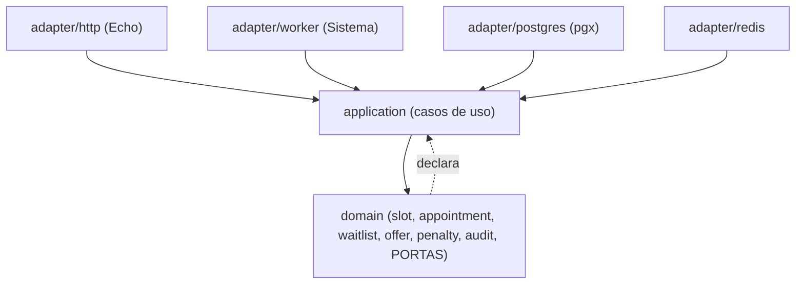
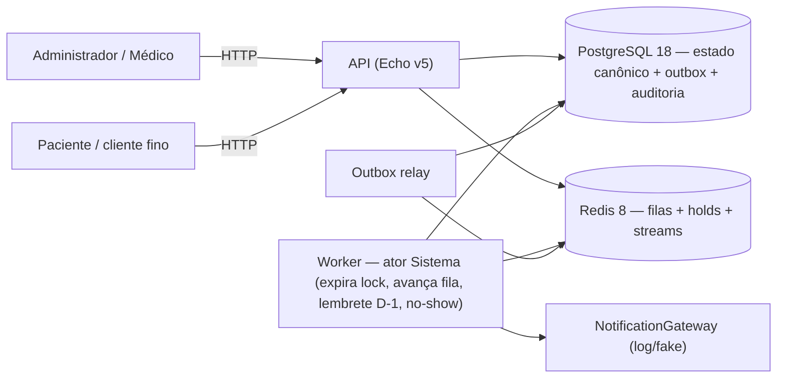
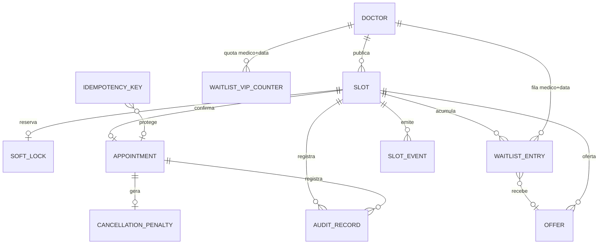
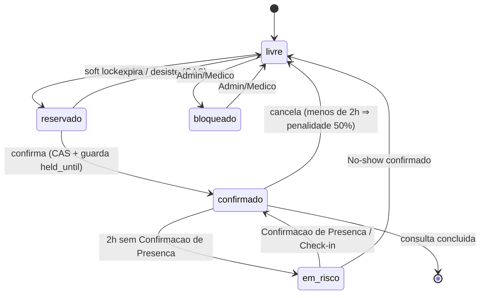
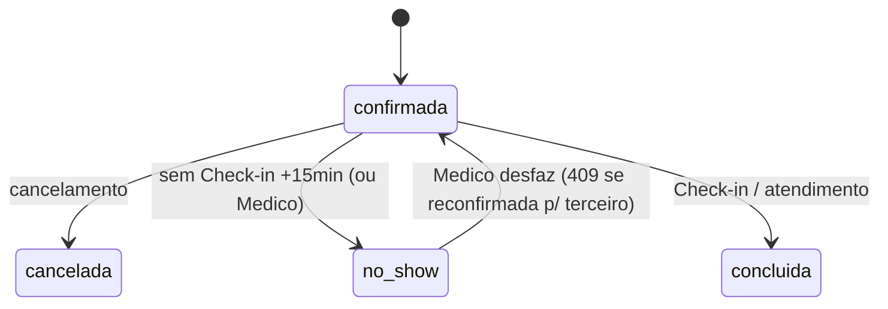

# Architecture Spine — AgendaFácil

> **Atualizado com o PRD (final, 2026-09-01).** A primeira versão deste spine foi
> derivada só do brief + addendum. O PRD ampliou o escopo do MVP (publicação de
> agenda, no-show, auditoria/observabilidade), reverteu o modelo de
> anti-starvation (agora quota + teto, não score composto) e formalizou os NFRs.
> `AD-3, AD-4, AD-5, AD-7, AD-9` foram emendados; `AD-10` (máquina de estados da
> consulta) e `AD-11` (trilha de auditoria) são novos. Itens `[ASSUMPTION]`
> restantes vêm do §9 do PRD e são confirmáveis na spec.

## Design Paradigm

**Hexagonal (ports & adapters).** O núcleo de domínio decide; a infraestrutura
serve. Concorrência é resolvida por regra de domínio, não por artefato de banco.

| Camada | Namespace | Papel |
| --- | --- | --- |
| Domain | `internal/domain` | Entidades (`slot`, `appointment`, `waitlist`, `offer`, `penalty`, `audit`), máquinas de estado, portas. Não importa infra. |
| Application | `internal/app` | Casos de uso (publicar agenda, criar soft lock, confirmar, cancelar, entrar/sair da fila, avançar fila, aceitar oferta, expirar lock, marcar no-show, enviar lembrete). Orquestra transação + portas. |
| Adapters | `internal/adapter/{http,postgres,redis,worker}` | Echo, pgx, cliente Redis, worker do ator Sistema. Implementam as portas. |
| Platform | `internal/platform` | Config, logging, relógio, migrações. |

Atores: **Paciente**, **Médico**, **Administrador** (cadastra médicos, publica
slots) e **Sistema** (jobs: expira lock, avança fila, lembrete D-1, marca
no-show). O **worker do ator Sistema** é um adapter que invoca os mesmos casos de
uso da API — nenhuma automação tem caminho de escrita próprio.

## Invariants & Rules



Regra: dependências apontam só para dentro. As portas são declaradas no domain e
implementadas nos adapters. `domain` não importa nada de `adapter`/`platform`.

### AD-1 — PostgreSQL é o store transacional canônico (não MongoDB) `[ADOPTED]`

- **Binds:** toda persistência de estado — `slot`, `appointment`, `soft_lock`, `waitlist_entry`, `offer`, `idempotency_key`, `slot_event` (outbox), `audit_record`, `cancellation_penalty`, `doctor`, `waitlist_vip_counter`.
- **Prevents:** adotar um document store sem transação multi-linha ACID de primeira classe e sem índice único parcial — a garantia "um slot = no máximo uma consulta confirmada" viraria lógica de aplicação frágil e o double-booking voltaria pela camada de dados.
- **Rule:** o estado canônico vive em Postgres. "No máximo uma consulta *confirmada* por slot" é uma **constraint de banco** — índice único parcial em `slot_id WHERE appointment.status = 'confirmada'` — não uma checagem de aplicação. MongoDB não entra no núcleo. Postgres é escolhido por três propriedades que o núcleo usa diretamente: (a) índice único parcial como rede de segurança independente da corretude do código; (b) transação ACID multi-tabela para "confirmar + sair da fila + gravar evento + gravar auditoria" atômica; (c) `UPDATE ... WHERE status = <esperado>` com contagem de linhas afetadas como CAS otimista nativo, sem lock pessimista.

### AD-2 — Soft lock sem lock pessimista: CAS otimista em Postgres + marca com TTL em Redis `[ADOPTED]`

- **Binds:** fluxo `livre → reservado → confirmado`; todos os cenários de concorrência do addendum e do PRD §4.3/§4.4.
- **Prevents:** `SELECT ... FOR UPDATE` (ou advisory lock bloqueante) segurando a linha do slot durante os 15 min de decisão do paciente — serializa o atendimento, prende conexões, não escala; e dois pacientes confirmando o mesmo slot.
- **Rule:**
  - Toda transição de slot é `UPDATE slots SET status = ?, ... WHERE slot_id = ? AND status = <esperado>`, verificando `rows_affected = 1`. Zero linhas = perdeu a corrida → erro de domínio `SlotUnavailable` (`409`). Nunca `FOR UPDATE`, nunca lock bloqueante.
  - O soft lock materializa em duas partes: (a) a linha do slot vai a `status = 'reservado'` com `held_by` e `held_until = now() + 15min` (UTC) via o CAS acima; (b) a chave Redis `slot:<id>:hold = <patient_id>` com `EX 900`, como índice rápido e fonte de expiração proativa.
  - **Postgres é a verdade; Redis é acelerador.** Em divergência, `held_until` no Postgres decide.
  - Expiração preguiçosa: qualquer leitura ou transição que encontre `status = 'reservado' AND held_until < now()` trata o slot como `livre` e executa o CAS `reservado → livre` antes de prosseguir. O TTL do Redis e o job do ator Sistema são apenas o caminho proativo.
  - Confirmação = CAS `reservado → confirmado WHERE held_by = ? AND held_until > now()`. Falha por expiração no instante do submit cai no mesmo `SlotUnavailable` (com oferta de entrada na fila).
  - A transição preguiçosa `reservado → livre` também passa pelo método de domínio `Slot.transition` e grava o evento no outbox e o registro de auditoria **na mesma transação** (AD-7, AD-8, AD-11). Um caminho de leitura que não pode abrir transação de escrita **não executa o CAS** — trata o slot como livre apenas para exibição e deixa a materialização para o worker ou para o próximo caso de uso de escrita que tocar o slot.
  - Um paciente tem no máximo **1 soft lock ativo por médico+data** simultaneamente; exceder → `409` (PRD FR-5). `[ASSUMPTION]` do PRD §9.
  - `[ASSUMPTION]` o lock não é renovável na v1.
  - `[ASSUMPTION]` o discriminador de concorrência é a coluna `status` + timestamps, não uma coluna `version` numérica genérica.

### AD-3 — Redis para as filas de espera e a coordenação efêmera (não RabbitMQ) `[ADOPTED]`

- **Binds:** fila de espera por slot, fila de espera por médico+data, janela de aceite de 30 min, expiração de soft lock, agendamento de lembrete D-1.
- **Prevents:** trazer um message broker para um problema que é de **estado ordenado consultável**, não de transporte de mensagens — e perder a resposta a "quem é o próximo elegível para o slot X" dentro de um broker que não se inspeciona nem se reordena.
- **Rule:**
  - Existem **dois escopos de fila** (PRD FR-10..FR-15, escolha do usuário: ambos no MVP):
    - por slot: `waitlist:slot:<slot_id>`;
    - por médico+data: `waitlist:doctor:<doctor_id>:<yyyy-mm-dd>` (UTC).
  - Cada escopo é um Redis **Sorted Set** cujo membro é o `patient_id` e cujo score é a posição calculada pela função de ordenação do AD-4. Operações: `ZADD` (entrar), `ZRANGE`/`ZPOPMIN` (candidatos), `ZREM` (sair).
  - **Seleção do próximo elegível ao liberar um slot** funde os candidatos da fila do slot **e** da fila médico+data daquela data, ordenados pela função do AD-4 sobre o conjunto unido. No máximo **uma oferta *pendente* por slot** a qualquer instante (FR-12). Um paciente atendido por uma oferta é removido de **todas** as filas em que estava para aquele médico+data (FR-15).
  - A oferta ativa (janela de 30 min) é a chave Redis `offer:<slot_id>` com `EX 1800` **mais** uma linha `offers` no Postgres (autoridade + auditoria + idempotência). Expiração da chave → o ator Sistema avança para o próximo elegível. Os 30 min contam a partir do instante de **notificação enviada** registrado pelo Sistema (PRD FR-12).
  - **Criação de oferta é CAS:** `INSERT ... ON CONFLICT DO NOTHING` sobre o índice único parcial `offers(slot_id) WHERE status = 'pendente'`, com checagem de linhas afetadas (mesma disciplina do AD-2/AD-5). Um Cancelamento (FR-8) e o avanço de uma oferta expirada (FR-13) disparando ao mesmo tempo para o mesmo slot convergem para **exatamente uma** oferta *pendente*, sem paciente pulado nem servido duas vezes (PRD FR-12).
  - RabbitMQ / Kafka ficam **fora**. Fan-out de eventos de domínio para outros módulos (pagamento etc.) está em *Deferred*.
  - `[ASSUMPTION]` Redis roda com `appendonly yes` (AOF) — a fila não pode evaporar num restart; perda tolerável = o último segundo.
  - Onde possível, usar o compare-and-set nativo do Redis 8.4+ para a transição de posse da oferta, em vez de script Lua.

### AD-4 — Ordenação da fila e anti-starvation: quota + teto de espera (modelo do PRD)

- **Binds:** fila de espera (ambos os escopos), fila VIP, criação de oferta.
- **Prevents:** dois builders ordenando a fila de formas incompatíveis (um por timestamp de entrada, outro por flag VIP, um terceiro por "score composto"); ordem não-determinística; e starvation do paciente comum sob fluxo contínuo de VIPs.
- **Rule:** a ordenação é uma **função pura do domínio**, avaliada na criação de cada oferta sobre as linhas `waitlist_entry` do conjunto unido (AD-3) mais o contador `waitlist_vip_counter` do escopo:
  1. **Classe primeiro:** `VIP` antes de `comum`.
  2. **Dentro da classe:** ordem de entrada (`enqueued_at`, UTC).
  3. **Anti-starvation, mecanismo A — quota:** um contador de ofertas *consecutivas* concedidas a VIPs, **keyed por médico+data** (o escopo da união das duas filas — AD-3), contador único, incrementado exatamente **uma vez por oferta criada** para qualquer slot daquele médico+data. Passado `ANTI_STARVATION_QUOTA` (default **3**, configurável), a próxima oferta vai para o primeiro `comum` elegível, ignorando VIPs à frente nessa rodada. O contador **zera** sempre que um `comum` recebe oferta (por quota ou naturalmente).
  4. **Anti-starvation, mecanismo B — teto:** um `comum` esperando há mais que `ANTI_STARVATION_CEILING` (default **24h**, configurável) recebe prioridade máxima — é o próximo, independentemente de VIPs à frente. Dois comuns acima do teto: ordem de entrada entre si.
  - Determinística: mesmo estado de fila + mesmo contador ⇒ sempre o mesmo próximo paciente, sem empate resolvido por acaso.
  - O **modelo de score composto / `vip_boost`** da versão anterior deste AD está **descartado**. O Redis Sorted Set guarda apenas o resultado já calculado da função (índice/cache); o contador e a lógica de teto vivem no domínio, com o contador persistido em Postgres (autoridade — AD-9).
  - Um `comum` promovido por teto que recusa/expira a oferta volta à fila com o `enqueued_at` original (não é penalizado), mas a quota (mecanismo A) conta a concessão como feita a um `comum`. `[ASSUMPTION]` PRD §9.

### AD-5 — Idempotência: chave obrigatória em toda mutação, registrada na mesma transação, resposta rejogada `[ADOPTED]`

- **Binds:** PRD FR-1, FR-2, FR-3, FR-5, FR-7, FR-8, FR-10, FR-11, FR-14, FR-20, FR-23, FR-24 — toda escrita mutante da API; e as automações do ator Sistema.
- **Prevents:** retry de cliente, duplo-clique ou retry automático criando uma segunda consulta, penalidade, entrada na fila; e cada endpoint inventando seu próprio esquema de dedupe.
- **Rule:**
  - Todo `POST`/`PUT` de mutação exige o header `Idempotency-Key` (UUID). Ausente → `400`.
  - Tabela `idempotency_keys(key PK, request_fingerprint, response_status, response_body, created_at, expires_at)`. Primeira vez: processa **dentro da mesma transação** que a mutação de domínio, grava a resposta, commita. Repetição com mesma key + mesmo fingerprint → devolve a resposta gravada, zero efeito colateral. Mesma key + fingerprint **diferente** → `422` (conflito de chave — PRD FR-25; era `409` na versão anterior).
  - A inserção da key é `INSERT ... ON CONFLICT DO NOTHING` com checagem de linhas afetadas — a mesma disciplina de CAS do AD-2 — servindo de trava contra a corrida de dois retries simultâneos. Duas requisições concorrentes com a mesma key: uma executa; a outra **espera e devolve a resposta original** ou responde `409 "em processamento"` — `[ASSUMPTION]` (PRD open question #4, a decidir na spec).
  - A key expira em **24h** (janela fixa no MVP, sem configuração para estender). Repetição após o TTL vencido é tratada como requisição nova — e então barrada pelas invariantes de domínio.
  - **Invariante de negócio acima da chave:** repetir a Confirmação com uma key *diferente* quando o paciente já tem consulta naquele slot devolve a **consulta existente**, não um erro — a chave protege o transporte, a invariante `(slot, consulta confirmada)` protege o domínio (PRD FR-7).
  - As automações do Sistema (expirar lock, avançar fila, disparar lembrete, marcar no-show) derivam uma key **determinística** de `(tipo, entidade, janela)` — ex. `reminder:<appointment_id>:D-1` — então reexecutar o job não duplica.
  - `[ASSUMPTION]` idempotência é da camada de aplicação; não exige exactly-once da infraestrutura.

### AD-6 — Tempo em UTC, aritmética de janela no domínio via porta `Clock` `[ADOPTED]`

- **Binds:** soft lock (15 min), janela de aceite (30 min), cancelamento (<2 h), lembrete (D-1), *em risco* (2 h), no-show (+15 min), check-in (−30/+15 min), teto de espera (24 h).
- **Prevents:** um builder calculando janela com a hora local do cliente e outro com UTC → bug de fuso; `held_until` gravado em hora local.
- **Rule:** todo timestamp persistido é `timestamptz` em UTC. Toda duração é calculada no domínio a partir de uma porta `Clock` injetável (testável), nunca da hora do request. Conversão para o fuso da clínica só no serializador da borda HTTP (offset anexado como metadado de apresentação). As invariantes de unicidade **não** dependem de os relógios de app e banco estarem sincronizados; só a precisão dos prazos depende, com tolerância declarada (PRD §10).
  - `[ASSUMPTION]` Lembrete D-1 disparado às **18:00 no fuso da clínica**, convertido para UTC no agendamento do job (PRD FR-19). Configurabilidade por clínica e slots em múltiplos fusos: open question #4.

### AD-7 — Estado do slot como máquina de estados explícita com caminho único de transição

- **Binds:** all.
- **Prevents:** builders introduzindo transições divergentes ou owners diferentes escrevendo `slots.status`.
- **Rule:** estados = `livre | reservado | confirmado | em_risco | bloqueado` (PRD Glossário). Transições legais:
  - `livre → reservado` (soft lock, CAS)
  - `reservado → livre` (expira / desiste, CAS)
  - `reservado → confirmado` (confirma, CAS com guarda `held_until`)
  - `confirmado → em_risco` (2 h antes do início sem Confirmação de Presença — FR-21)
  - `em_risco → confirmado` (Confirmação de Presença ou Check-in do paciente original — FR-21)
  - `confirmado → livre` (cancelamento — FR-8)
  - `em_risco → livre` (No-show confirmado — FR-22)
  - `livre ↔ bloqueado` (Admin/Médico sobre slot *livre* — FR-3)
  - Toda transição passa por um único método de domínio `Slot.transition(to, guard)` que emite o SQL CAS do AD-2 e grava outbox + auditoria na mesma transação. **Só o serviço de agendamento escreve a tabela `slots`** — inclui a expiração preguiçosa do AD-2, o job de no-show, o job de lembrete e qualquer consumidor de evento: nenhum escreve `slots.status` direto; todos chamam o caso de uso. `confirmado` como estado do slot ⇔ existe uma consulta em estado `confirmada` para o slot.

### AD-8 — Eventos de domínio persistidos via outbox; consumidores idempotentes `[ADOPTED]`

- **Binds:** avanço de fila (reage a slot liberado), agendamento de lembrete, registro de penalidade, marcação de no-show, auditoria.
- **Prevents:** fila e cancelamento disputando escrita no mesmo slot; automações acopladas por chamada direta; perder o "por que este slot abriu".
- **Rule:** toda transição de estado grava um evento na tabela outbox (`slot_events`) **na mesma transação** que a mutação. Um relay lê o outbox e publica em Redis (stream) para os consumidores internos (avanço de fila, agendador de lembrete, registrador de penalidade). Consumidores são idempotentes (AD-5) e podem reprocessar. Relação com **AD-11**: o outbox move consumidores assíncronos; a trilha de auditoria é a história durável e consultável — podem compartilhar uma tabela de transições ou ser duas tabelas escritas na mesma transação. `[ASSUMPTION]` outbox em Postgres + relay simples, não CDC/Debezium nesta escala. `[ASSUMPTION]` a política de retry/backoff do relay fica para a spec.

### AD-9 — Autoridade e reconciliação das filas de espera `[ADOPTED]`

- **Binds:** fila de espera (ambos os escopos), avanço de fila, contador de quota do AD-4.
- **Prevents:** um builder tratando o Sorted Set do Redis como autoridade e outro tratando a tabela `waitlist_entry` do Postgres como autoridade → divergência de membros e ordem após um restart do Redis.
- **Rule:** `waitlist_entry` no Postgres é a **autoridade** de quem está em cada fila e com que parâmetros (`enqueued_at`, `class`, `scope`); `waitlist_vip_counter` no Postgres, **uma linha por médico+data**, é a **autoridade** da quota do AD-4. Os Sorted Sets do Redis (dos dois escopos) são índices de ordenação **derivados**, reconstruíveis por inteiro a partir das tabelas. Toda entrada/saída da fila escreve `waitlist_entry` na transação do caso de uso e, no mesmo caso de uso, faz `ZADD`/`ZREM` no Redis (best-effort). Na inicialização do worker e periodicamente, um reconciliador reprojeta os Sorted Sets a partir das tabelas (idempotente — AD-5). A leitura "próximo elegível" consulta o Redis; em miss ou inconsistência, cai para o cálculo do AD-4 direto no Postgres.

### AD-10 — Consulta como máquina de estados própria, com dono único, sincronizada ao slot por evento

- **Binds:** confirmação, cancelamento, no-show, check-in, sobreposição do médico.
- **Prevents:** um builder escrevendo `appointment.status` a partir do job de no-show, de um consumidor de lembrete ou de um handler de check-in diretamente; e os estados do slot e da consulta divergirem (ex. slot `livre` mas consulta ainda `confirmada`).
- **Rule:** estados da consulta = `confirmada | cancelada | concluida | no_show` (PRD Glossário). Transições passam por `Appointment.transition(to, guard)` **no mesmo caso de uso e na mesma transação** que a transição pareada do slot (AD-7) e o evento de outbox (AD-8). O job de no-show, o check-in e a sobreposição do médico chamam o caso de uso de agendamento — nunca escrevem `appointments.status` direto. O índice único parcial do AD-1 fica em `slot_id WHERE appointment.status = 'confirmada'`. Desfazer um no-show quando o slot já foi reconfirmado para um terceiro → `409` com o conflito explicitado (`[ASSUMPTION]` PRD FR-24; fluxo de resolução é open question #5).

### AD-11 — Trilha de auditoria imutável como capacidade de primeira classe (no escopo do MVP)

- **Binds:** PRD FR-27, FR-28; toda transição de `slot`, `appointment`, `soft_lock`, `offer`, `penalty`.
- **Prevents:** perder a história de "por que este slot abriu / quem foi pulado na fila"; e a verificação das invariantes (zero double-booking etc.) depender de inspeção manual em vez de um endpoint.
- **Rule:** toda transição de estado grava um `audit_record` **append-only** (`entity`, `entity_id`, `prev_state`, `new_state`, `actor ∈ {patient_id | doctor_id | system}`, `cause`, `ts` UTC) na **mesma transação** que a mutação e o evento de outbox. Registros de auditoria **nunca** são atualizados nem apagados. A tabela de auditoria é a fonte para reconstrução de história (`GET /audit?entity&id`) e sustenta o endpoint de verificação de invariantes (`GET /metrics/invariants`: zero slots com duas consultas *confirmadas*, zero ofertas *pendentes* duplicadas por slot, zero penalidades duplicadas por consulta, distribuição de tempo de espera de pacientes comuns). Nenhuma transição de estado ocorre sem registro correspondente (verificável cruzando contagem de eventos com contagem de mudanças). Todo job do Sistema emite métricas: itens processados, transições feitas, duração.

## Consistency Conventions

| Concern | Convention |
| --- | --- |
| Naming — entidades / tabelas | entidade singular, tabela plural (`slot` → `slots`). |
| Naming — eventos | past tense: `slot.reserved`, `slot.confirmed`, `slot.cancelled`, `slot.at_risk`, `slot.blocked`, `appointment.no_show`, `offer.made`, `offer.expired`, `offer.accepted`, `penalty.assessed`. |
| Naming — portas Go | sufixo `Repository` (persistência) / `Gateway` (serviço externo, ex. `NotificationGateway`). |
| Notificações | `NotificationGateway` — lembrete D-1 e avisos de oferta passam por ela; impl. de referência = adapter de log/fake. O timestamp "notificação enviada" que inicia a janela de 30 min é o instante em que o Sistema registra a entrega à porta. Canais reais fora de escopo (PRD §10). |
| IDs | `[ASSUMPTION]` UUIDv7 (ordenável no tempo, bom índice). |
| Datas & formatos | RFC3339 UTC na API, com offset da clínica como metadado de apresentação; `timestamptz` no banco; durações como `time.Duration` string (`15m`, `30m`, `2h`). |
| Erros | envelope `{ code, message, conflict? }`; `conflict` presente em `409` descrevendo o estado atual da entidade; `code` é enum estável (`slot_unavailable`, `idempotency_key_conflict`, `offer_expired`, `soft_lock_limit`, …). |
| Idempotency-Key | header obrigatório em toda mutação; formato UUID; replay c/ corpo diferente → `422`. |
| Config (12-factor) | `ANTI_STARVATION_QUOTA` (3), `ANTI_STARVATION_CEILING` (24h), `SOFT_LOCK_TTL` (15m), `OFFER_WINDOW` (30m), `CANCELLATION_PENALTY_WINDOW` (2h), `SYSTEM_JOB_INTERVAL` (curto o bastante p/ SM-5 ≤ 30s), `IDEMPOTENCY_TTL` (24h, fixo). |
| Migrations | versionadas, forward-only (ex. golang-migrate). |
| Mutação de estado | sempre CAS (`UPDATE ... WHERE status = <esperado>` / `INSERT ... ON CONFLICT`) com checagem de linhas afetadas; nunca lock pessimista. |
| Versão de API | breaking change só em nova major de rota (`/v2/...`); campos novos são aditivos. `[ASSUMPTION]` |
| Auth | `[ASSUMPTION]` fora do núcleo — identidade (`patient_id` / `doctor_id`) é claim confiável resolvido por middleware. Se o claim carrega a classe VIP ou ela é consultada internamente: open question #2. |

## Stack

| Name | Version |
| --- | --- |
| Go | 1.26 |
| Echo | v5 |
| PostgreSQL | 18 |
| Redis | 8 (8.4+ p/ CAS nativo) |
| Docker | Compose (dev) |
| pgx | `[ASSUMPTION]` v5 |
| golang-migrate | `[ASSUMPTION]` current |
| testcontainers-go | `[ASSUMPTION]` current |

## NFRs / Envelope Operacional

Formalizado a partir do PRD §7/§9/§12 (a dimensão que a v1 do spine deixou em aberto):

- **Escala-alvo do teste de contenção deliberada:** ~50 médicos, ~1000 slots/dia, 200 pacientes concorrentes, até **50 requisições simultâneas por slot**.
- **SM-5 — latência de liberação:** p95 do atraso entre o gatilho (lock vencido, janela de aceite vencida, no-show) e a transição de estado efetiva **≤ 30 s**. FR-6/FR-13 impõem o mesmo limite ⇒ `SYSTEM_JOB_INTERVAL` curto o bastante para cumprir.
- **SM-C1 — contra-métrica:** nunca trocar uma invariante de unicidade ou uma escrita de auditoria por latência.
- **Consistência sob falha:** job/requisição interrompido no meio e reexecutado converge — sem slot preso em `reservado` por lock órfão, sem oferta `pendente` sem dono, sem penalidade parcial.
- **Sem SLA de produção, sem alvo de custo de infra, sem RTO/RPO** — implementação de referência (PRD §12). Alvos numéricos são para verificação em teste, não capacidade de produção.

## Structural Seed

### Container



### Modelo de dados (nomes e relações; atributos ficam com o código)



Invariante de dados (não um mero atributo): índice único parcial garantindo no
máximo uma consulta `status = 'confirmada'` por `slot_id` — ver AD-1.

### Máquina de estados do slot



### Máquina de estados da consulta



### Árvore-fonte

```text
cmd/
  api/            # binário HTTP (Echo)
  worker/         # binário do ator Sistema + outbox relay
internal/
  domain/         # slot, appointment, waitlist, offer, penalty, audit, portas, máquinas de estado
  app/            # casos de uso (1 por operação)
  adapter/
    http/         # handlers Echo, serialização de borda, middleware idempotência
    postgres/     # repositórios pgx, SQL CAS, outbox, auditoria
    redis/        # sorted sets das filas, chaves de hold/offer, stream consumer
    worker/       # schedulers (expirar lock, avançar fila, lembrete D-1, no-show)
  platform/       # config, clock, logging, migrations
migrations/
```

## Área → Arquitetura

| Área (PRD) | Vive em | Governada por |
| --- | --- | --- |
| Publicação de agenda (FR-1..FR-3) | `app` + `adapter/http` + `adapter/postgres` | AD-1, AD-5, AD-7, AD-11 |
| Descoberta de slots (FR-4) | `app` + `adapter/postgres` (leitura) | AD-2, AD-6, AD-7 |
| Soft lock 15 min (FR-5, FR-6) | `app` + `adapter/postgres` + `adapter/redis` + `adapter/worker` | AD-2, AD-6, AD-7 |
| Confirmação idempotente (FR-7) | `app` + `adapter/http` (middleware) + `adapter/postgres` | AD-2, AD-5, AD-7, AD-10 |
| Cancelamento + penalidade 50% (FR-8, FR-9) | `app` + `domain/penalty` | AD-6, AD-7, AD-8, AD-10, AD-11 |
| Fila de espera por slot e médico+data + janela 30 min (FR-10..FR-15) | `domain/waitlist` + `domain/offer` + `adapter/redis` + `adapter/worker` | AD-3, AD-4, AD-8, AD-9 |
| Fila VIP anti-starvation (FR-16..FR-18) | `domain/waitlist` (função de ordenação + quota + teto) | AD-4, AD-9 |
| Lembrete D-1 + Confirmação de Presença + *em risco* (FR-19..FR-21) | `adapter/worker` + `app` + `NotificationGateway` | AD-5, AD-6, AD-8, AD-7 |
| No-show + Check-in + sobreposição do Médico (FR-22..FR-24) | `app` + `adapter/worker` + `domain/appointment` | AD-6, AD-7, AD-10, AD-11 |
| Idempotência + jobs do Sistema (FR-25, FR-26) | `adapter/http` (middleware) + `adapter/worker` | AD-5, AD-8 |
| Observabilidade + auditoria (FR-27, FR-28) | `domain/audit` + `adapter/postgres` + `adapter/http` | AD-11, AD-8 |
| Resolução de concorrência | `domain` + `adapter/postgres` (CAS) | AD-1, AD-2, AD-7, AD-10 |

## Deferred

- **Fila de espera por médico+data com pré-oferta condicional (FR-21 forma plena)** — MVP marca *em risco* a T-2h e cria oferta real só após No-show confirmado (FR-22). Pré-oferta condicional (aceite condicional que só converte após No-show) fica para v2 (PRD §6.2, escolha do usuário).
- **Pagamento / cobrança da penalidade** — o núcleo só grava `cancellation_penalty` como *devida*.
- **Teleconsulta, prontuário eletrônico, prescrição, dado clínico** — fora do escopo.
- **Message broker entre serviços (RabbitMQ/Kafka)** — só quando existir um segundo serviço consumindo eventos de domínio.
- **Frontend rico / app nativo / UI web** — a entrega é a API.
- **Canais reais de notificação (email/SMS/push)** — só a `NotificationGateway` com adapter de referência.
- **Gestão avançada de disponibilidade** — recorrência, feriados, bloqueio/realocação de slot já *confirmado* (FR-3 estendido).
- **Isenção de penalidade por regra clínica** — v2.
- **Multi-tenant / múltiplas unidades / descoberta pública.**
- **Deploy além de Docker Compose (K8s, autoscaling).**
- **Renovação de soft lock** e **política de retry/backoff do relay de outbox** — parâmetros da spec.
- **Persistência da resposta idempotente além de 24h.**

## Open Questions

1. Corrida de idempotência concorrente (FR-25): a 2ª requisição com a mesma key **bloqueia até a resposta** ou retorna `409 "em processamento"`?
2. O claim de auth carrega a classe VIP do paciente, ou ela é consultada internamente? (afeta AD-4 / FR-16)
3. `ANTI_STARVATION_QUOTA = 3` e `ANTI_STARVATION_CEILING = 24h` são adequados ao volume esperado? Variam por especialidade?
4. Disparo do Lembrete D-1 (18:00 fuso da clínica): configurável por clínica? Slots em múltiplos fusos?
5. Desfazer No-show após a vaga já ter sido reconfirmada por terceiro (FR-24): `409` é final ou há um fluxo de resolução?
