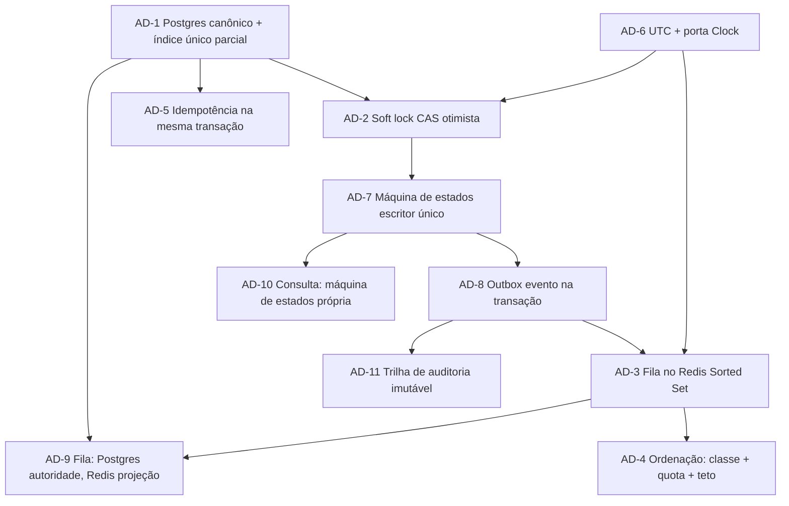

# Solution Design — AgendaFácil

Documento de acompanhamento do [`ARCHITECTURE-SPINE.md`](./ARCHITECTURE-SPINE.md).
O spine fixa as invariantes de forma terse; aqui fica o **porquê** — contexto,
alternativas pesadas, trade-offs aceitos e o que mudaria a decisão. Nenhuma regra
nova nasce aqui; se algo abaixo contradiz o spine, o spine vence.

Entrada: `brief.md` + `addendum.md` + `prd.md` (final, 2026-09-01). Stack
verificada na web em set/2026: Go 1.26, Echo v5, PostgreSQL 18, Redis 8.

> **Atualização com o PRD.** A primeira versão deste documento foi escrita sem o
> PRD. A seção **6. Reconciliação com o PRD** (ao final) cobre o que mudou:
> reversão do modelo de anti-starvation (AD-4), as duas novas decisões (AD-10
> máquina de estados da consulta, AD-11 trilha de auditoria), a fila de espera
> em dois escopos, e os NFRs agora formalizados. As seções 0–4 abaixo
> permanecem válidas como escritas; onde o PRD as ajusta, a seção 6 diz como.

---

## 0. Paradigma: Hexagonal (ports & adapters)

**Contexto.** O valor do AgendaFácil, segundo o brief, é *corretude sob
concorrência* — não a tela. As regras críticas (soft lock, expiração, ordem da
fila, janelas temporais) precisam ser testáveis de forma determinística e
isoladas de Postgres/Redis/HTTP.

**Alternativas.**

| Opção | Por que não |
| --- | --- |
| Layered (controller → service → repository) | Camadas vazam infra para cima (o service acaba conhecendo `pgx`); testar concorrência exige subir o banco. |
| Transaction Script | Cada endpoint vira um procedimento; a máquina de estados do slot se espalha em N lugares — exatamente o que o AD-7 previne. |
| **Hexagonal** | Portas no domínio, adapters na borda. Testes de regra rodam com fakes em memória; testes de concorrência real rodam com `testcontainers`. O worker do ator Sistema reusa os mesmos casos de uso. |

**Trade-off aceito.** Mais boilerplate de interface no começo (portas + duas
implementações). Compensa quando os testes de contenção deliberada do brief
precisam ser rápidos e repetíveis.

**O que mudaria.** Se o projeto encolhesse para um CRUD de agenda sem fila nem
concorrência, layered simples bastaria.

---

## 1. PostgreSQL e não MongoDB para os slots  → AD-1

**Contexto.** O invariante central é "nenhum slot com duas consultas
confirmadas, mesmo sob requisições concorrentes". A pergunta é onde esse
invariante *mora*: no código ou no armazenamento.

**Alternativas pesadas.**

- **MongoDB.** Transações multi-documento existem desde a 4.x, mas continuam de
  segunda classe: custo maior, retry de `TransientTransactionError` na
  aplicação, e o modelo de documento *convida* a embutir a fila de espera dentro
  do documento do slot — o que transforma "entrar na fila" e "confirmar" em
  escritas concorrentes no mesmo documento (contenção). Índice único parcial
  (`partialFilterExpression`) existe mas cobre menos casos que o do Postgres.
  Ganho real (schema flexível) não se aplica: slot, agendamento e fila têm forma
  fixa e relacional.
- **PostgreSQL.** Entrega três coisas que o núcleo usa *diretamente*:
  1. **Índice único parcial** `UNIQUE (slot_id) WHERE status = 'confirmed'` — uma
     rede de segurança no nível do armazenamento. Mesmo com um bug na lógica de
     CAS, o banco recusa a segunda confirmação. O invariante não depende da
     corretude do código.
  2. **Transação ACID multi-tabela** — "confirmar consulta + remover da fila +
     gravar evento no outbox" commita atômico ou não commita.
  3. **`UPDATE ... WHERE status = <esperado>` + linhas afetadas** — um
     compare-and-set otimista nativo, que é a base do AD-2 (soft lock sem lock
     pessimista).

**Decisão.** Postgres 18 como store transacional canônico. Mongo fora do núcleo.

**Trade-off aceito.** Schema rígido, migrações versionadas. Para este domínio é
vantagem, não custo.

**O que mudaria.** Se aparecesse um subdomínio realmente sem forma fixa e sem
invariante de unicidade (ex.: logs de auditoria de altíssimo volume, blobs de
notificação), um store secundário poderia entrar — mas para *aquele* dado, não
para os slots.

---

## 2. Soft lock sem lock pessimista  → AD-2

**Contexto.** O paciente segura um slot por 15 min enquanto decide. A abordagem
ingênua — `SELECT ... FOR UPDATE` na linha do slot até ele confirmar — mantém
uma transação de banco aberta por minutos: conexões presas, `idle in
transaction`, atendimento serializado. O addendum proíbe isso explicitamente.

**Mecanismo escolhido: CAS otimista em Postgres + marca com TTL em Redis.**

1. **Adquirir o lock.**
   `UPDATE slots SET status='held', held_by=:p, held_until=now()+interval '15 min'
   WHERE slot_id=:s AND status='free'`.
   `rows_affected = 1` → consegui. `0` → perdi a corrida → `SlotUnavailable`.
   Sem `FOR UPDATE`; a cláusula `WHERE status='free'` é o teste-e-troca.
2. **Índice de expiração no Redis.** `SET slot:<id>:hold <patient_id> EX 900`.
   Serve para (a) o worker do Sistema varrer holds a expirar sem escanear a
   tabela e (b) leituras rápidas de "está travado?".
3. **Postgres é a verdade.** Se o Redis cair ou divergir, `held_until` na linha
   decide. O Redis nunca é a fonte da verdade do lock — só um acelerador.
4. **Expiração preguiçosa.** Qualquer caso de uso de escrita que encontre
   `status='held' AND held_until < now()` faz o CAS `held → free` (via
   `Slot.transition`, gravando o evento no outbox na mesma transação) antes de
   prosseguir. O TTL do Redis e o job do worker são só o caminho *proativo* — a
   corretude não depende deles rodarem no horário.
5. **Confirmar.**
   `UPDATE slots SET status='confirmed' WHERE slot_id=:s AND status='held'
   AND held_by=:p AND held_until > now()`.
   Se o lock expirou no exato instante do submit, `rows_affected = 0` →
   `SlotUnavailable` + oferta de fila. Cobre o cenário "lock expira no instante
   da confirmação" do addendum.

**Alternativas pesadas.**

| Opção | Veredito |
| --- | --- |
| `SELECT ... FOR UPDATE` durante a decisão | Proibido pelo addendum; não escala. |
| Advisory lock do Postgres (`pg_advisory_lock`) por 15 min | É lock pessimista com outro nome; prende sessão. |
| Coluna `version` inteira + CAS na versão | Funciona, mas `status` já é o discriminador natural e legível em auditoria; `version` seria redundante. |
| Só Redis (`SET NX` com TTL) como lock | Perde o lock num restart do Redis sem AOF; e o estado do slot precisa estar no Postgres de qualquer forma (AD-1). Redis vira single point of failure para corretude. |
| `SET NX` no Redis **como fonte da verdade** + espelho no PG | Dois donos do mesmo fato; divergência sem árbitro. Rejeitado — vira o mesmo problema que o AD-9 teve que consertar na fila. |

**Trade-off aceito.** Dupla escrita (linha do slot + chave Redis) no caminho
feliz. A chave Redis é best-effort: se falhar, o lock ainda vale (Postgres), só a
expiração proativa fica mais lenta (cai na preguiçosa).

**Por que isto elimina o double-booking.** Duas confirmações concorrentes do
mesmo slot viram dois `UPDATE ... WHERE status='held'`. O Postgres serializa as
duas no nível da linha (isso é lock de linha *momentâneo* do próprio `UPDATE`,
não lock pessimista de aplicação): uma vê 1 linha afetada, a outra vê 0. E se as
duas passassem, o índice único parcial do AD-1 barra a segunda no commit.

**O que mudaria.** Lock renovável (o paciente pede mais tempo) — deixado de fora
da v1; entra como um `UPDATE ... SET held_until = ... WHERE held_by = :p AND
status = 'held'` (mais um CAS), sem mudança estrutural.

---

## 3. Redis e não RabbitMQ para a fila de espera  → AD-3, AD-4, AD-9

**Contexto.** Quando o slot está ocupado, o paciente entra numa fila. Quando a
vaga abre, o primeiro elegível ganha 30 min para aceitar; não aceitou, passa
para o próximo. VIPs têm prioridade, mas sem starvation dos comuns.

**A observação-chave.** Isto **não é transporte de mensagens** — é uma
**estrutura de dados ordenada que precisa ser consultada e modificada por
posição**:

- "quem é o próximo elegível para o slot X?"
- "remova o paciente Y da fila (ele desistiu / conseguiu outro slot)"
- "recalcule a prioridade de todo mundo que está esperando há mais de 48h"

**Por que RabbitMQ (ou Kafka) não serve.**

| Necessidade | Broker entrega? |
| --- | --- |
| Ler o 3º da fila sem consumir os 2 primeiros | Não — filas de broker são consumo-destrutivo/sequencial. |
| Remover um elemento arbitrário do meio | Não. |
| Reordenar por prioridade dinâmica (anti-starvation) | Não — ordem é de chegada (ou partição), não recalculável. |
| Inspecionar o estado ("mostre a fila do médico X") | Mal — requer ferramentas de management, não query. |
| TTL por elemento (janela de 30 min) | Parcial e desajeitado (dead-letter + TTL de fila). |

RabbitMQ resolveria *entrega confiável de eventos entre serviços* — problema que
o AgendaFácil **não tem** hoje (é um serviço só). Quando tiver (módulo de
pagamento consumindo `slot.cancelled`), aí um broker entra — está em *Deferred*.

**Mecanismo escolhido: Redis Sorted Set + chave com TTL.**

- Fila = `ZADD waitlist:<scope> <score> <patient_id>`. Score = função de
  prioridade (abaixo). `ZRANGE ... LIMIT 1` dá o próximo; `ZREM` tira alguém do
  meio; re-score = `ZADD` de novo (idempotente).
- Oferta ativa = `SET offer:<scope> <patient_id> EX 1800` + linha
  `waitlist_offers` no Postgres (auditoria + idempotência). A chave expira →
  o worker avança.
- `[ASSUMPTION]` Redis com `appendonly yes` — a fila não pode sumir num restart.

### 3a. Anti-starvation: um score, uma fila  → AD-4

Duas filas separadas (VIP e comum) obrigam uma regra de arbitragem ("a cada 3
VIPs, 1 comum") — mais um contador com estado, mais um lugar para bug. Em vez
disso, **uma fila só**, com score composto determinístico:

```
score(entry) = enqueued_at_unix_ms  −  vip_boost  −  age_promotion(tempo_esperando)
```

Menor score primeiro. O VIP entra com um desconto fixo (`vip_boost`,
`[ASSUMPTION]` 24h em ms — como se tivesse chegado 24h antes). O
`age_promotion` cresce com a espera de forma que, passado um teto
(`[ASSUMPTION]` 48h), qualquer paciente comum já ultrapassou um VIP que acabou
de chegar. Resultado: VIP tem vantagem, mas ela é *limitada no tempo* — starvation
fica matematicamente impossível acima do teto.

A função é **pura e vive no domínio** (Go), não em Lua no Redis. O Redis só
guarda o número. Isso mantém a regra testável sem Redis e evita que dois builders
escrevam Luas divergentes.

### 3b. Autoridade da fila  → AD-9 *(achado no reviewer gate)*

O AD-3 sozinho deixava um buraco: se a fila "é" o Sorted Set do Redis, mas o
AD-1 diz "todo estado canônico no Postgres", dois desenvolvedores podem assumir
autoridades diferentes e divergir depois de um restart do Redis (mesmo com AOF,
perde-se o último segundo).

**Regra do AD-9:** a tabela `waitlist_entry` no Postgres é a **autoridade**;
o Sorted Set é uma **projeção derivada**, 100% reconstruível a partir dela. Todo
caso de uso escreve a tabela na transação e faz `ZADD`/`ZREM` best-effort. O
worker reprojeta o Sorted Set a partir da tabela no boot e periodicamente. Leitura
do "próximo" usa o Redis; em inconsistência, cai para `ORDER BY score` no
Postgres. Mesma filosofia do AD-2: **Postgres é a verdade, Redis é velocidade.**

**Trade-off aceito.** O Redis pode ficar momentaneamente stale; a reconciliação
converge. Aceitável — a janela de aceite é de 30 min, não de 30 ms.

---

## 4. Idempotência nas operações de agendamento  → AD-5

**Contexto.** Rede instável, duplo-clique, retry automático do cliente. Sem
proteção, cada uma dessas cria uma segunda consulta / segunda penalidade /
segunda entrada na fila. O addendum exige: *toda* escrita idempotente.

**Mecanismo escolhido: chave de idempotência + tabela + resposta rejogada, tudo
na mesma transação.**

1. Todo `POST`/`PUT` de mutação exige header `Idempotency-Key` (UUID do cliente).
   Ausente → `400`. (Contrato explícito; nada de "adivinhar" duplicata por
   heurística de payload.)
2. Tabela `idempotency_keys (key PK, request_fingerprint, response_status,
   response_body, created_at, expires_at)`.
3. **Primeira vez:** dentro da **mesma transação** que a mutação de domínio —
   `INSERT ... ON CONFLICT DO NOTHING` na `idempotency_keys`, executa a mutação,
   grava a resposta, commita. O `ON CONFLICT DO NOTHING` + linhas afetadas é o
   mesmo CAS do AD-2: se dois retries chegam juntos, só um insere e processa; o
   outro vê 0 linhas e vira "repetição".
4. **Repetição, mesma key + mesmo fingerprint:** devolve `response_status` /
   `response_body` gravados. Zero efeito colateral.
5. **Mesma key + fingerprint diferente:** `409` (cliente reusou uma key para
   outra requisição — erro dele).
6. **Automações do Sistema** também são idempotentes, com key *determinística*
   derivada de `(tipo, entidade, janela)` — ex. `reminder:<appointment_id>:D-1`,
   `expire:<slot_id>:<held_until>`. O job pode rodar duas vezes (crash, deploy,
   overlap de cron) sem duplicar efeito.

**Por que "na mesma transação" importa.** Se a gravação da chave e a mutação
fossem transações separadas, uma falha entre as duas deixaria a mutação feita
sem registro de idempotência → o próximo retry duplicaria. Atômico ou nada.

**Alternativas pesadas.**

| Opção | Veredito |
| --- | --- |
| Dedupe por hash do payload, sem header | Frágil: dois agendamentos legítimos idênticos (mesmo paciente, reagendou pro mesmo horário depois) colidiriam. |
| Idempotência só no gateway/CDN | Não cobre retry de servidor→banco nem as automações internas. |
| `Idempotency-Key` no Redis com TTL | Perde a garantia atômica com a mutação no Postgres; Redis vira dependência de corretude de escrita. |
| Exactly-once de infra (broker transacional) | Complexidade desproporcional; e não há broker (AD-3). |

**Trade-off aceito.** `[ASSUMPTION]` a chave expira em 24h — depois disso um
retry é tratado como requisição nova. A janela real de retry de cliente é de
segundos a minutos; 24h é folga generosa. Tabela cresce; um job de limpeza varre
`expires_at < now()`.

**O que mudaria.** Se surgisse requisito de retry idempotente com janela de dias
(ex.: reconciliação de sistema externo), aumenta-se o TTL — sem mudança
estrutural.

---

## Como as decisões se sustentam mutuamente



O fio condutor: **Postgres guarda a verdade e serializa as corridas via CAS;
Redis acelera; toda transição vira evento e registro de auditoria na mesma
transação; consumidores são idempotentes.**

---

## 6. Reconciliação com o PRD

O PRD (final, 2026-09-01) chegou depois da primeira versão do spine. Ele não
contradiz o núcleo (AD-1, AD-2, AD-5, AD-6, AD-8 seguem como escritos), mas:
amplia o escopo do MVP, **reverte** o modelo de anti-starvation e formaliza os
NFRs. Registro do que mudou e por quê.

### 6.1 AD-4 revertido — de score composto para quota + teto

**O que a v1 do spine fez.** Modelava a fila como uma função pura
`score = enqueued_at_ms − vip_boost − age_promotion(waited)` num único Sorted
Set, e **rejeitava explicitamente** um mecanismo de quota "N VIPs : 1 comum" por
exigir um contador com estado.

**O que o PRD pede (§3, §4.7, FR-16..FR-18).** Dois mecanismos combinados:
(A) **quota** — após `N=3` ofertas consecutivas a VIPs numa fila, o próximo
comum elegível é promovido; (B) **teto** — um comum esperando há mais que 24h
ganha prioridade máxima. Ambos configuráveis. A ordenação-base é classe (VIP
antes de comum) e, dentro da classe, ordem de entrada.

**Decisão.** Seguir o PRD (escolha do usuário na re-execução). O score composto
sai. A ordenação passa a ser uma função de domínio avaliada na criação de cada
oferta, sobre as linhas `waitlist_entry` mais o contador de quota. O contador
**tem estado** — é o custo que o PRD aceita para tornar a garantia "a cada N+1
liberações um comum é servido" diretamente verificável (SM-4), em vez de emergir
de uma constante `vip_boost` calibrada.

**Trade-off aceito.** Um contador persistido a mais (`waitlist_vip_counter`,
uma linha por médico+data) e a reconciliação dele junto com o Sorted Set
(AD-9). Em troca: o comportamento anti-starvation é legível e testável ponto a
ponto, não uma propriedade emergente de aritmética de score.

**O que mudaria.** Se o volume mostrar que a quota N=3 é agressiva demais (VIP
perde vantagem prática — contra-métrica SM-C3), os dois parâmetros são env
vars; nada estrutural muda.

### 6.2 Fila de espera em dois escopos

O PRD tem fila por Slot (FR-10..FR-14, no MVP) e fila por Médico+data (FR-15,
marcada opcional/v2). O usuário optou por **ambas no MVP**. AD-3 passa a ter
dois Sorted Sets (`waitlist:slot:<id>` e `waitlist:doctor:<id>:<data>`); ao
liberar um slot, a seleção do próximo elegível **funde** os candidatos das duas
filas daquela data e ordena pela função do AD-4 sobre o conjunto unido. Um
paciente servido sai de todas as filas do médico+data. O contador de quota é
keyed por médico+data — o escopo da união — para não divergir entre as duas
filas (endurecimento do reviewer gate).

### 6.3 AD-10 novo — consulta como máquina de estados própria

O PRD separa claramente o estado do **Slot** (`livre | reservado | confirmado |
em_risco | bloqueado`) do estado da **Consulta** (`confirmada | cancelada |
concluida | no_show`), com no-show, check-in e sobreposição do médico agindo
sobre a consulta. A v1 do spine só tinha a máquina do slot. AD-10 fixa que a
consulta transiciona por um único método de domínio, **na mesma transação** que
a transição pareada do slot e o evento de outbox, e que jobs (no-show) e
handlers (check-in) chamam o caso de uso — nunca escrevem `appointments.status`
direto. Sem isso, dois builders poderiam deixar slot e consulta divergirem
(slot `livre`, consulta ainda `confirmada`).

### 6.4 AD-11 novo — trilha de auditoria como capacidade de MVP

A v1 tinha "observabilidade detalhada" em *Deferred*. O PRD §4.11 (FR-27, FR-28)
a traz para dentro do MVP: **valor do produto é ser correto e auditável sob
carga**. AD-11 fixa um `audit_record` append-only por transição de qualquer
entidade (slot, consulta, soft lock, oferta, penalidade), escrito na mesma
transação da mutação, nunca atualizado nem apagado, servindo tanto a
reconstrução de história (`GET /audit`) quanto o endpoint de verificação de
invariantes (`GET /metrics/invariants`). Relação com o outbox (AD-8): o outbox
move consumidores assíncronos; a auditoria é a história durável — podem
compartilhar uma tabela de transições, decisão de implementação.

### 6.5 NFRs agora formalizados

| Antes (v1) | Agora (PRD) |
| --- | --- |
| "clínica ou rede pequena", sem números | Escala-alvo do teste: ~50 médicos, ~1000 slots/dia, 200 pacientes concorrentes, até 50 req. simultâneas/slot (§9) |
| Sem alvo de latência | SM-5: p95 do atraso gatilho→transição ≤ 30s; `SYSTEM_JOB_INTERVAL` dimensionado a partir disso |
| RTO/RPO em aberto | Sem RTO/RPO, sem SLA de produção, sem alvo de custo — implementação de referência (§12) |
| Deploy em aberto | Docker Compose (dev) + Postgres/Redis gerenciados; K8s/autoscaling seguem *Deferred* |

### 6.6 Pendências que sobraram para a `bmad-spec`

O PRD fechou B1 (escopo da fila → ambos), D1 (janela conta da notificação
enviada), D2 (D-1: marca *em risco* a T-2h, oferta real só após no-show
confirmado — pré-oferta condicional fica para v2), D3 (penalidade = 50% do
Valor de Referência fixado na criação do slot), D4 (`N=3` / teto `24h`), D5
(TTL 24h fixo; D-1 às 18:00 fuso da clínica). Restam:

| # | Pendência (PRD §8) |
| --- | --- |
| 1 | Corrida de idempotência concorrente (FR-25): 2ª requisição com mesma key bloqueia até a resposta ou retorna `409 "em processamento"`? |
| 2 | O claim de auth carrega a classe VIP do paciente, ou ela é consultada internamente? (afeta AD-4 / FR-16) |
| 3 | `N=3` / teto `24h` adequados ao volume esperado? Variam por especialidade? |
| 4 | Disparo do Lembrete D-1 (18:00 fuso da clínica): configurável por clínica? Slots em múltiplos fusos? |
| 5 | Desfazer No-show após reconfirmação por terceiro (FR-24): `409` é final ou há fluxo de resolução? |
